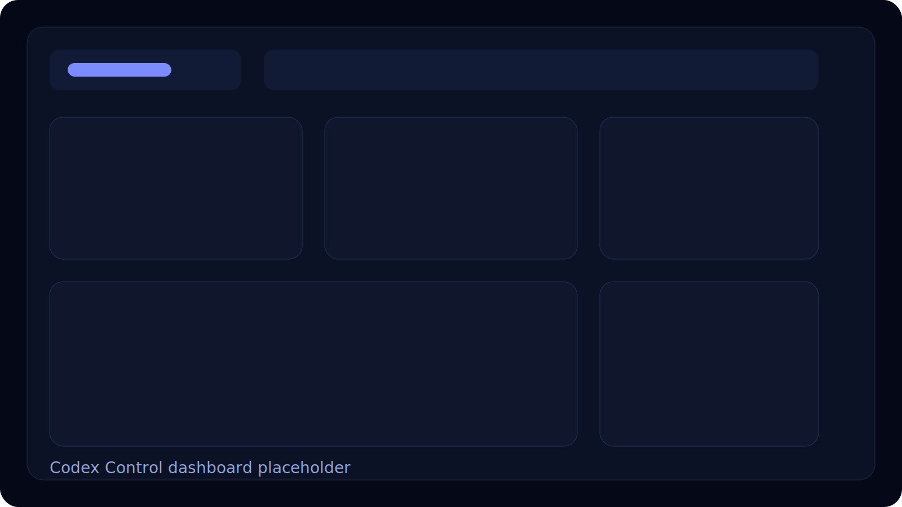

# Codex Control

A local desktop dashboard for monitoring and managing multiple Codex CLI sessions in real time.



## Features

- Auto-discovers local Codex CLI activity from the process table and local hook events.
- Ingests Codex hook payloads through a dedicated `codex-control-hook` CLI.
- Tracks sessions by session id, working directory, repository metadata, branch, model, transcript path, status, prompts, commands, approval state, and timestamps.
- Groups live sessions by repository and shows timeline details per session.
- Surfaces quick actions for opening terminals, opening editors, inspecting transcripts, reviewing Git diff stats, and terminating a local process after explicit confirmation.
- Persists data locally in SQLite with JSONL spool fallback.
- Redacts likely secrets before anything is stored.
- Targets macOS and Linux first.

## Install

### Prerequisites

- Rust stable toolchain
- Node.js 20+
- npm 10+
- SQLite runtime available locally
- Codex CLI installed on the same machine

### From source

```bash
git clone https://github.com/albertbac/codex-control.git
cd codex-control
npm install
cargo test --workspace
npm run test
npm run tauri:dev
```

## Hook setup

Install the hook CLI into your PATH:

```bash
cargo install --path packages/hook-cli
```

Then copy the provided examples into your Codex configuration:

- `examples/hooks/config.toml`
- `examples/hooks/hooks.json`

The examples are designed for local-only ingestion and safe policy denial responses.

## Development commands

```bash
npm run dev
npm run build
npm run lint
npm run test
npm run tauri:dev
npm run tauri:build
cargo test --workspace
```

## Security model

- Local-first by design.
- Local SQLite database, with JSONL spool fallback if SQLite cannot be opened.
- No default outbound telemetry.
- Hook policy acts as a guardrail, not as a universal enforcement layer.
- Destructive shell commands are denied through the policy CLI.
- Approval requests are never auto-approved.

See [docs/security.md](docs/security.md) for details.

## Known limitations

- The dashboard uses polling for live updates in this first release.
- Session resumption from the dashboard is intentionally shown as unavailable until a robust local handoff is implemented.
- Transcript parsing is tolerant and best-effort; malformed transcript files are preserved as-is and do not crash ingestion.
- Windows hooks are not documented as production-ready.

## Platform support

- macOS: primary target
- Linux: primary target
- Windows: desktop experimentation is possible, but hooks are not documented as production-ready
