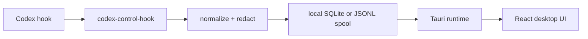

# Architecture

## Local flow

Codex Control has a local-only flow:

1. Codex CLI emits a hook event.
2. `codex-control-hook` reads one JSON object from stdin.
3. The hook CLI normalizes and redacts the event.
4. The event is persisted to the local store, or to a JSONL spool if the database is unavailable.
5. The desktop app reads local session data and enriches it with process, Git, and transcript context.
6. The React UI renders dashboard cards and session timelines.

## Hook CLI to store

The hook CLI is the ingestion boundary. It is intentionally small:

- read exactly one JSON object from stdin
- preserve unknown fields under `payload`
- apply redaction before persistence
- exit quietly on successful ingestion
- write diagnostics to stderr only

SQLite is the preferred store. JSONL spool is a fallback so hook calls do not fail just because the database is temporarily unavailable.

## Desktop app

The desktop app is a Tauri application with a React frontend.

The Rust runtime exposes commands for:

- dashboard snapshots
- session timelines
- Git inspection
- transcript inspection
- process discovery
- local settings and paths

The UI currently polls for updates. A push transport can be added later without changing the hook contract.

## Process discovery

`process_watcher.rs` scans local processes for Codex CLI activity.

Process data is used as enrichment, not as the source of truth. Hook events remain the authoritative session history.

Captured process context is intentionally limited to what the dashboard needs:

- process id
- current working directory when available
- parent process when available
- command line summary
- approximate process age

## Session store

The session store tracks normalized events and reduced session state.

Main records:

- events
- sessions
- schema migrations

Session state is reduced from hook events. Stale sessions can be marked `unknown` or `finished` when process discovery no longer sees a process and no recent hook events arrive.

## Git inspection

`git_inspector.rs` enriches each session with repository state:

- repo root
- repo name
- branch
- changed file count
- staged count
- unstaged count
- diff stat summary

Git failures do not block the dashboard. A missing or non-Git working directory is reported as unavailable context.

## Transcript handling

`transcript_parser.rs` reads the transcript path when Codex provides one.

Transcript parsing is best-effort:

- missing files are tolerated
- malformed lines are skipped
- unexpected formats do not stop dashboard rendering
- transcript files are never modified

## Technical limits

- Hooks observe what Codex is configured to emit; they are not universal shell enforcement.
- `PostToolUse` cannot undo effects that already happened.
- Process discovery varies by operating system and local permissions.
- Windows hook behavior is not treated as a release target.
