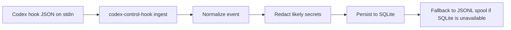

# Architecture

## Overview

Codex Control has four local layers:

1. `codex-control-hook` reads hook JSON from stdin, normalizes it, redacts likely secrets, and persists it.
2. `codex-core` owns the shared domain model, event normalization, status reduction, storage, transcript parsing helpers, Git inspection helpers, and policy rules.
3. The Tauri desktop runtime reads the local store, enriches sessions with process and Git information, and exposes commands to the React UI.
4. The React UI polls for dashboard and timeline snapshots and renders the current local state.

## Hook ingestion

## Process discovery

`process_watcher.rs` scans local processes for Codex CLI commands.

Process discovery is enrichment only. The authoritative session history comes from hook events.

Collected fields include:

- pid
- cwd
- parent pid when available
- uptime
- command line

## Session store

Storage is local only.

- Primary store: SQLite
- Fallback store: JSONL spool
- Schema tracking: `schema_migrations`

Current tables:

- `events`
- `sessions`
- `schema_migrations`

## Live update flow

The current desktop build uses polling rather than a push channel.

## Status reducer

Session status is reduced from hook events.

- `SessionStart` => `idle`
- `UserPromptSubmit` => `working`
- `PreToolUse` => `working`
- `PermissionRequest` => `waiting_approval`
- `PostToolUse` => `working` or `errored`
- `Stop` => `idle` or `finished`
- missing process plus stale session => `unknown` or `finished`

## Git inspection

`git_inspector.rs` enriches sessions with:

- repo root
- repo name
- branch
- changed files count
- staged count
- unstaged count
- diff stat summary

Git inspection failures should never block the dashboard.

## Transcript handling

`transcript_parser.rs` is best-effort by design.

It:

- tolerates missing files
- tolerates malformed lines
- attempts to extract the last assistant message, last user prompt, and last command
- never mutates transcript files
