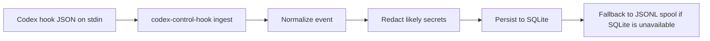
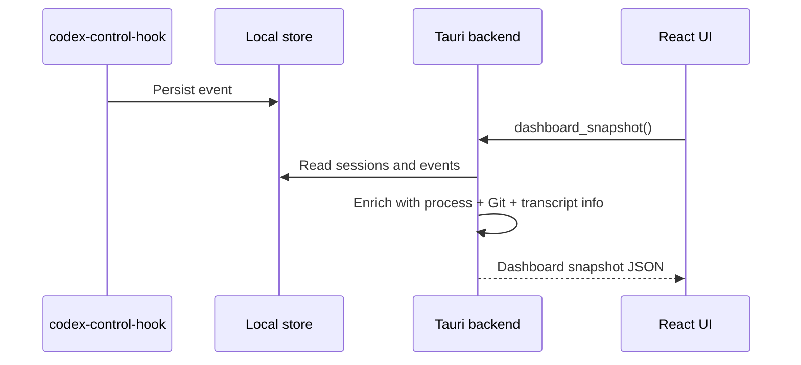

# Architecture

## Overview

Codex Control has four local-only layers:

1. `codex-control-hook` reads hook JSON from stdin, normalizes it, redacts likely secrets, and persists it.
2. `codex-core` owns domain models, event normalization, status reduction, storage, transcript parsing helpers, repository context lookup, and policy rules.
3. The Tauri desktop backend reads the local store, enriches sessions with process and Git information, and exposes commands to the React UI.
4. The React UI polls dashboard and timeline commands to present live state grouped by repository.

## Hook ingestion

## Process discovery

`process_watcher.rs` scans local processes for Codex CLI commands. Process data is enrichment only. The authoritative session timeline comes from hook events.

Collected fields:

- pid
- cwd
- parent pid when available
- uptime
- command line

## Session store

Storage is local only.

- Primary: SQLite
- Fallback: JSONL spool file
- Schema migrations: versioned in code through `schema_migrations`

Tables:

- `events`
- `sessions`
- `schema_migrations`

## Live update flow

The first release uses polling instead of push transport.

## Status reducer

Status changes are driven by hook events:

- `SessionStart` => `idle`
- `UserPromptSubmit` => `working`
- `PreToolUse` => `working`
- `PermissionRequest` => `waiting_approval`
- `PostToolUse` => `working` or `errored`
- `Stop` => `idle` or `finished`
- missing process plus stale session => `unknown` or `finished`

## Git inspection

`git_inspector.rs` enriches sessions with:

- repo root
- repo name
- branch
- changed files count
- staged count
- unstaged count
- diff stat summary

Failures in Git inspection never block the dashboard.

## Transcript handling

`transcript_parser.rs` uses best-effort parsing.

- tolerates missing files
- tolerates malformed lines
- attempts to extract the last assistant message, last user prompt, and last command
- never mutates transcript files
